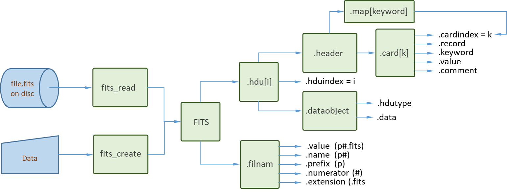

# CamiFITS.jl

FITS stands for *Flexible Image Transport System*. This is an open standard originally developed for the astronomy community to store telescope images together with tables of spectral information. Over the years it has developed into a scientific standard [[W. D. Pence et al., A&A, 524 (2010) A42](https://doi.org/10.1051/0004-6361/201015362)]. The standard is maintained by the [FITS Support Office](http://fits.gsfc.nasa.gov/) at NASA/GSFC [[FITS standard - Version 4.0](https://fits.gsfc.nasa.gov/fits_standard.html)]. The website also offers a [FITS Conformance Verifier](https://fits.gsfc.nasa.gov/fits_verify.html). 

CamiFITS offers the *basic FITS functionality* for scientific users not requiring celestal coordinates. Optional *Conforming Extensions* are under development. The user can create, read and extend .fits files as well as create, edit and delete user-defined metainformation.

*Disclaimer 2023-05-19:* The author is currently writing the manual. In this process the code is tested, both with regard to FITS conformance and runtest coverage. Known issues remain to be solved and the package certainly did not reach a stable form.

# Table of contents

```@contents
```
# Install

The package is installed using the Julia package manager

```
julia> using Pkg; Pkg.add("CamiFITS")

julia> using CamiFITS
```

# Manual
### Introduction

A FITS file consists of a sequence of one or more *Header and Data Units* ([`FITS_HDU`](@ref)s), each containing a [`FITS_data`](@ref) block (containing one or more images) preceeded by a [`FITS_header`](@ref) of records with metainformation.

Among the *STANDARD HDU data types* we distinguish between *IMAGE*, *ARRAY*,
*ASCII_TABLE* and *BINTABLE* HDU types. The first HDU in 
a `.fits` file is called the *PRIMARY HDU*.

Let "example.fits" be an *existing* `.fits` file. By the commands 

```
julia> filnam = "example.fits"
"example.fits"

julia> f = fits_read(filnam);
```
we asign the [`FITS`](@ref) object (read from the `.fits` file `filnam` on dic) to the variable `f`. 
All information of a given `.fits` file is stored in the [`FITS`](@ref) object,
its structure is shown in the flow chard below.



The fields of `f` (`f.hdu[1]`, `f.hdu[2]`, ...) correspond to 
[`FITS_HDU`](@ref) objects. The *PRIMARY HDU* of the [`FITS`](@ref) object is
represented by `f.hdu[1]`. The header records are contained in an array of *single-record* `card`s.

The formal terminology of the [FITS standard](https://fits.gsfc.nasa.gov/fits_standard.html) can be consulted using 
[`fits_terminology`](@ref): 
```
julia> fits_terminology("HDU")
HDU:
Header and Data Unit. A data structure consisting of a header and the data the 
header describes. Note that an HDU may consist entirely of a header with no 
data blocks.
```
#### Creating a simple FITS file
FITS files can be created using the command [`fits_create`](@ref). This process
proceeds in two steps: (a) first a [`FITS`](@ref) object is constructed 
starting from the data provided (in Julia format); (b) this [`FITS`](@ref) 
object is autosaved under the specifified name (e.g., `name.fits`).

###### Example:
The minimal file conforming to the FITS standard consists of a single HDU 
with an empty data field.
```
julia> filnam = "minimal.fits";

julia> f = fits_create(filnam; protect=false);

julia> fits_info(f)

File: minimal.fits
hdu: 1
hdutype: PRIMARY
DataType: Any
Datasize: (0,)

Metainformation:
SIMPLE  =                    T / file does conform to FITS standard
BITPIX  =                   64 / number of bits per data pixel
NAXIS   =                    1 / number of data axes
NAXIS1  =                    0 / length of data axis 1
BZERO   =                  0.0 / offset data range to that of unsigned integer  
BSCALE  =                  1.0 / default scaling factor
EXTEND  =                    T / FITS dataset may contain extensions
COMMENT    Extended FITS HDU   / http://fits.gsfc.nasa.gov/
END

Any[]
```
Note how the [`FITS`](@ref) object is inspected using the [`fits_info`](@ref) tool.

The header of a [`FITS_HDU`](@ref) is contained in an array of *single-record*
`.card` objects as illustrated in the figure above. To find the `cardindex` 
associated with a keyword (e.g., "NAXIS") we can use the `header.map`:
```
julia> i = f.hdu[1].header.map["NAXIS"]
3
```
The result is easily verified:
```
julia> f.hdu[1].header.card[i].cardindex
3
```
The full record is:
```
julia> f.hdu[1].header.card[3].record
"NAXIS   =                    1 / number of data axes  
```
Once ready it is good practice to remove the example: 
```
julia> rm(filnam); f = nothing
```

#### The FITS file for a single image

Rather than inspecting the [`FITS`](@ref) object directly CamiFITS offers the
[`fits_info`](@ref) and [`fits_record_dump`](@ref) tools. To demonstrate these 
tools we first create the image data field in the form of a 3x3 matrix:
```
julia> filnam = "matrix.fits";

julia> data = [11,21,31,12,22,23,13,23,33];

julia> data = reshape(data,(3,3,1))
3×3×1 Array{Int64, 3}:
[:, :, 1] =
 11  12  13
 21  22  23
 31  23  33
```
We next create and inspect the FITS object for the matrix `data`.
```
julia> f = fits_create(filnam, data; protect=false);

julia> fits_info(f)

File: matrix.fits
hdu: 1
hdutype: PRIMARY
DataType: Int64
Datasize: (3, 3, 1)

Metainformation:
SIMPLE  =                    T / file does conform to FITS standard
BITPIX  =                   64 / number of bits per data pixel
NAXIS   =                    3 / number of data axes
NAXIS1  =                    3 / length of data axis 1
NAXIS2  =                    3 / length of data axis 2
NAXIS3  =                    1 / length of data axis 3
BZERO   =                  0.0 / offset data range to that of unsigned integer
BSCALE  =                  1.0 / default scaling factor
EXTEND  =                    T / FITS dataset may contain extensions
COMMENT    Primary FITS HDU    / http://fits.gsfc.nasa.gov
END

3×3×1 Array{Int64, 3}:
[:, :, 1] =
 11  12  13
 21  22  23
 31  23  33

julia> f = nothing
```
The keywords `NAXIS1`, `NAXIS2` and `NAXIS3` represent the dimensions 
of the ``x, y`` data matrix stacked in the ``z`` direction. 

The matrix elements are referred to as `pixels` and their bit size is 
represented by the keyword `BITPIX`. In the above example the pixel value 
is used to indicate the matrix indices.

The [`FITS`](@ref) object `f` has been closed above but its contents has been 
*autosaved* under the name `filnam` = 'matrix.fits' to disk. To access 
the image data of `filnam` we can [`fits_read`](@ref) the [`FITS`](@ref) object 
from disk or directly access its data for image processing in Julia using
[`fits_info`](@ref) :

```
julia> data = fits_info(filnam; msg=false)
3×3×1 Array{Int64, 3}:
[:, :, 1] =
 11  12  13
 21  22  23
 31  23  33

julia> rm(filnam); f = nothing
```

##### Comment
Note that the relevant mandatory keywords are *autogenerated* by [`fits_create`](@ref),
*starting from the Julia datatype* and using the *FITS object casting procedures*, 
[`cast_FITS`](@ref), [`cast_FITS_filnam`](@ref), [`cast_FITS_HDU`](@ref), 
[`cast_FITS_header`](@ref), [`cast_FITS_card`](@ref) and [`cast_FITS_data`](@ref).
The casting procedures keep track of comformance to the [`FITS standard`](https://fits.gsfc.nasa.gov/fits_standard.html). 

#### FITS keyword description tool

In the *CamiFITS* package the *mandatory FITS keywords* are *autogenerated*. 
To support easy user access to the definition of all *reserved FITS keywords* 
(mandatory or non-mandatory) *CamiFITS* includes the [`fits_keyword`](@ref) tool. 

The description of the *FITS keywords* is provided by [`fits_keyword`](@ref):
```
julia> fits_keyword("bitpix")
KEYWORD:    BITPIX
REFERENCE:  FITS Standard - version 4.0 - Appendix C
CLASS:      general
STATUS:     mandatory
HDU:        primary, groups, extension, array, image, ASCII-table, bintable,
VALUE:      integer
RANGE:      -64,-32,8,16,32,64
COMMENT:    bits per data value
DEFINITION: The value field shall contain an integer.  The absolute value is
used in computing the sizes of data structures. It shall specify the number of
bits that represent a data value (using a minus sign for floating point data).
```
Without argument [`fits_keyword`](@ref) provides the list of all 
FITS defined keywords (for the HDU types inplemented).
```
julia> fits_keyword()
FITS defined keywords:
(blanks) AUTHOR   BITPIX   BLANK    BLOCKED  BSCALE   BUNIT    BZERO            
CDELTn   COMMENT  CROTAn   CRPIXn   CRVALn   CTYPEn   DATAMAX  DATAMIN          
DATE     DATE-OBS END      EPOCH    EQUINOX  EXTEND   EXTLEVEL EXTNAME          
EXTVER   GCOUNT   GROUPS   HISTORY  INSTRUME NAXIS    NAXISn   OBJECT           
OBSERVER ORIGIN   PCOUNT   PSCALn   PTYPEn   PZEROn   REFERENC SIMPLE           
TBCOLn   TDIMn    TDISPn   TELESCOP TFIELDS  TFORMn   THEAP    TNULLn           
TSCALn   TTYPEn   TUNITn   TZEROn   XTENSION 

HDU options: 'primary', 'extension', 'array', 'image', 'ASCII-table', 'bintable'

reference: FITS Standard - version 4.0 - Appendix C
```
Specifying the *FITS HDU type* in [`fits_keyword`](@ref) the user obtains the 
restricted set of HDU-specific keywords.
```
julia> fits_keyword(hdutype="'PRIMARY '")
FITS defined keywords:
HDU type: 'primary'
- general
  - mandatory: BITPIX   END      NAXIS    NAXISn   SIMPLE
  - reserved : BLANK    BSCALE   BUNIT    BZERO    CDELTn   CROTAn   CRPIXn   
               CRVALn   CTYPEn   DATAMAX  DATAMIN  EXTEND
- bibliographic
  - mandatory:
  - reserved : AUTHOR   REFERENC
- commentary
  - mandatory:
  - reserved : (blanks) COMMENT  HISTORY
- observation
  - mandatory:
  - reserved : DATE-OBS EPOCH    EQUINOX  INSTRUME OBJECT   OBSERVER TELESCOP

HDU options: 'primary', 'extension', 'array', 'image', 'ASCII-table', 'bintable'

reference: FITS Standard - version 4.0 - Appendix C
```
By using the keyword "ALL" the user can dump the full list of keyword descriptions:
```
julia> fits_keyword("all")
FITS defined keywords:

KEYWORD:    (blank)
REFERENCE:  FITS Standard - version 4.0 - Appendix C
CLASS:      commentary
STATUS:     reserved
HDU:        primary, groups, extension, array, image, ASCII-table, bintable,
VALUE:      none
COMMENT:    descriptive comment
DEFINITION: Columns 1-8 contain ASCII blanks. This keyword has no associated 
value. Columns 9-80 may contain any ASCII text.  Any number of card images 
with blank keyword fields may appear in a header.
⋮
KEYWORD:    XTENSION
REFERENCE:  FITS Standard - version 4.0 - Appendix C
CLASS:      general
STATUS:     mandatory
HDU:        extension, array, image, ASCII-table, bintable,
VALUE:      string
COMMENT:    marks beginning of new HDU
DEFINITION: The value field shall contain a character string giving the name of 
the extension type. This keyword is mandatory for an extension header and must 
not appear in the primary header. For an extension that is not a standard 
extension, the type name must not be the same as that of a standard extension.

```
# API

### Terminology and keyword descriptions

```@docs
fits_terminology(term::String; test=false)
fits_keyword(keyword::String; msg=true)
```


### FITS 

#### Types

```@docs
FITS
FITS_filnam
FITS_HDU
FITS_header
FITS_card
FITS_data
```
#### Type casting

```@docs
cast_FITS(filnam::String, hdu::Vector{FITS_HDU})
cast_FITS_filnam(filnam::String)
cast_FITS_HDU(hduindex::Int, header::FITS_header, data::FITS_data)
cast_FITS_header(dataobject::FITS_data)
cast_FITS_header(record::Vector{String})
cast_FITS_card(cardindex::Int, record::String)
cast_FITS_data(hdutype::String, data)
```

### FITS - HDU Methods

```@docs
fits_info(f::FITS, hduindex=1; msg=true)
fits_record_dump(filnam::String, hduindex=0; hdr=true, dat=true, nr=true)
parse_FITS_TABLE(hdu::FITS_HDU)
```

#### FITS - File Methods

```@docs
fits_collect(filnamFirst::String, filnamLast::String; protect=true)
fits_copy(fileStart::String, fileStop::String=" "; protect=true)
fits_create(filnam::String, data=nothing; protect=true, msg=true)
fits_extend!(f::FITS, data_extend; hdutype="IMAGE")
fits_read(filnam::String)
fits_save_as(f::FITS, filnam::String; protect=true)
```

### FITS - Key Methods

```@docs
fits_add_key!(f::FITS, hduindex::Int, key::String, val::Any, com::String)
fits_delete_key!(f::FITS, hduindex::Int, key::String)
fits_edit_key!(f::FITS, hduindex::Int, key::String, val::Real, com::String)
fits_rename_key!(f::FITS, hduindex::Int, keyold::String, keynew::String)
```

## FORTRAN

```@docs
FORTRAN_format
cast_FORTRAN_format(str::String)
cast_FORTRAN_datatype(str::String)
```

## Plotting

```@docs
step125(x::Real)
select125(x)
steps(x::Vector{T} where T<:Real)
stepcenters(x::Vector{T} where T<:Real)
stepedges(x::Vector{T} where T<:Real)
edges(px, Δx=1.0, x0=0.0)
```

## Index

```@index
```