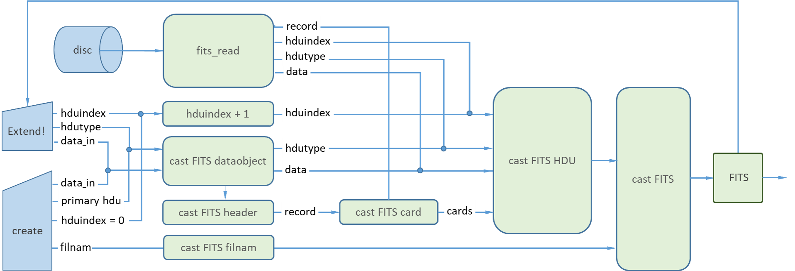

# API

## Introduction

The *Application Programming Interface* (API) for CamiFITS is based on 6 
*FITS-object structs* with dedicated *object-casting procedures to enforce the* 
[FITS standard ](https://fits.gsfc.nasa.gov/fits_standard.html). The API 
elements are typically called internally by one of the *Basic tools* but is
made available in the documentation to provide insight in the structure of 
CamiFITS.

## FITS-object structs
```@docs
FITS
FITS_filnam
FITS_HDU
FITS_header
FITS_card
FITS_dataobject
```

## FITS-object casting
The ordering of the FITS-object casting procedures is illustrated in the 
flow diagram below. 



The use of the casting procedures is *recommended* over direct application
of the FITS-object strucs *to ensure conformance to the* 
[FITS standard ](https://fits.gsfc.nasa.gov/fits_standard.html).

```@docs
cast_FITS_filnam(filnam::String)
cast_FITS_dataobject(hdutype::String, data)
cast_FITS_header(dataobject::FITS_dataobject)
cast_FITS_card(cardindex::Int, record::String)
cast_FITS_HDU(hduindex::Int, header::FITS_header, data::FITS_dataobject)
cast_FITS(filnam::String, hdu::Vector{FITS_HDU})
```

## FORTRAN-format struct 

```@docs
FORTRAN_format
```

## FORTRAN-format casting

```@docs
cast_FORTRAN_format(str::String)
```

## FORTRAN-related eltype

```
FORTRAN_eltype_char(T::Type)
FORTRAN_fits_table_tform(col::Vector{T}) where {T}
```