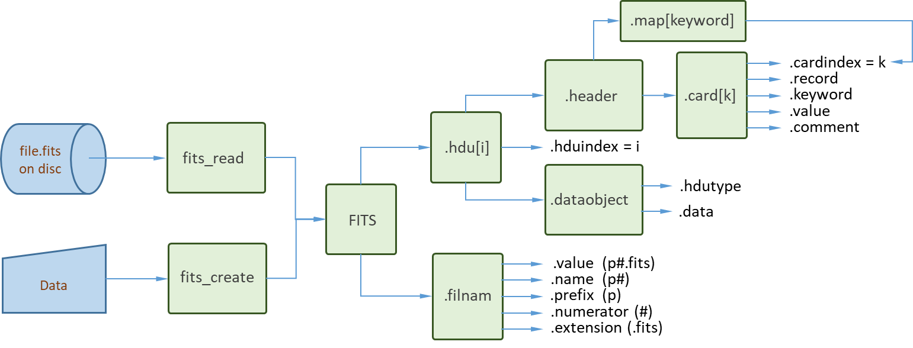

# Manual

## Introduction

A FITS file (with defining extension `.fits`) consists of a sequence 
of one or more *Header and Data Units* ([`FITS_HDU`](@ref)s), each containing 
a [`FITS_dataobject`](@ref) preceeded by a [`FITS_header`](@ref) of records 
with metainformation.

The first HDU in a `.fits` file  is called the *PRIMARY HDU*. It is an 
*IMAGE HDU*, one of the *STANDARD* HDU types *IMAGE*, *ASCII TABLE* and 
*BINTABLE*.

Let "example.fits" be an *existing* `.fits` file. By the commands 

```
julia> filnam = "example.fits"
"example.fits"

julia> f = fits_read(filnam);
```
we asign the [`FITS`](@ref) object (read from the `.fits` file `filnam` on disc) 
to the variable `f`. All information of a given `.fits` file is stored in 
this [`FITS`](@ref) object, its structure is shown in the diagram below.



The fields of `f` (`f.hdu[1]`, `f.hdu[2]`, ...) correspond to 
[`FITS_HDU`](@ref) objects. The *PRIMARY HDU* of the [`FITS`](@ref) object is
represented by `f.hdu[1]`. The header records are contained in an array of 
*single-record* `card`s.

The formal terminology of the [FITS standard]
(https://fits.gsfc.nasa.gov/fits_standard.html) can be consulted using 
[`fits_terminology`](@ref): 
```
julia> fits_terminology("HDU")
HDU:
Header and Data Unit. A data structure consisting of a header and the data the 
header describes. Note that an HDU may consist entirely of a header with no 
data blocks.
```
The words *must*, *shall*, *may*, *recommended*, *required* and *optional* are 
to be interpreted as described in the [IETF standard - RFC 2119]
(https://www.rfc-editor.org/info/rfc2119).
#### Creating a simple FITS file
FITS files can be created with the command [`fits_create`](@ref). This process
proceeds in two steps: (a) first a [`FITS`](@ref) object is constructed 
starting from the data provided (in Julia format); (b) this [`FITS`](@ref) 
object is *autosaved* under the specifified name (e.g., `name.fits`).

###### Example:
The minimal file conforming to the FITS standard consists of a single HDU 
with an *empty* data field.
```
julia> filnam = "minimal.fits";

julia> f = fits_create(filnam; protect=false);

julia> data = fits_info(f)

File: minimal.fits
hdu: 1
hdutype: PRIMARY
DataType: Any
Datasize: (0,)

Metainformation:
SIMPLE  =                    T / file does conform to FITS standard
BITPIX  =                   64 / number of bits per data pixel
NAXIS   =                    1 / number of data axes
NAXIS1  =                    0 / length of data axis 1
EXTEND  =                    T / FITS dataset may contain extensions
END

Any[]

julia> data
Any[]

julia> f.hdu[1].dataobject.data
Any[]
```
Note how the [`FITS`](@ref) object is inspected using the 
[`fits_info`](@ref) tool. Its output is the `data` of the hdu under 
consideration (in this case f.hdu[1]). By setting the keyword `protect` 
to `false` we remove the default overwrite protection for a file with 
the name `minimal.fits` on disc.

NB. The [`FITS_header`](@ref) is autogenerated from the data. 
The [`FITS`](@ref) object is made available *for inspection purposes only*. 
Direct editing is not advised as to assure conformance to the 
[[`FITS standard`](https://fits.gsfc.nasa.gov/fits_standard.html)]. 
Editing tools are made available in the section [`FITS Tools`](@ref).

The [`FITS_header`](@ref) of a [`FITS_HDU`](@ref) is contained in an array 
of *single-record* [`FITS_card`](@ref) objects as illustrated in the flow 
diagram at the start of the introduction. To find the `cardindex` 
associated with a keyword (e.g., "NAXIS") we can use the `header.map`:
```
julia> i = f.hdu[1].header.map["NAXIS"]
3
```
The result is easily verified by inspecting the field `card[i].cardindex`:
```
julia> f.hdu[1].header.card[i].cardindex
3
```
Likewise, by inspecting the field `card[i].keyword` we confirm
```
julia> f.hdu[1].header.card[i].keyword
"NAXIS"
```
The full record is:
```
julia> f.hdu[1].header.card[i].record
"NAXIS   =                    1 / number of data axes                            "
```
Once ready it is good practice to remove the example: 
```
julia> rm(filnam); f = nothing
```

### FITS inspection tools

Rather than inspecting the [`FITS`](@ref) object directly (as demonstrated 
above), CamiFITS offers the [`fits_info`](@ref) and 
[`fits_record_dump`](@ref) tools. These tools will be demonstrated in the next 
sections to demonstrate several [`FITS_HDU`](@ref) types.

## FITS file for a simple image

In this section we demonstrate the [`fits_info`](@ref) tool to inspect the 
primary hdu of a FITS object.

We start by creating a simple image in the form of a 3x3 matrix:
```
julia> filnam = "matrix.fits";

julia> data = [11,21,31,12,22,23,13,23,33];

julia> data = reshape(data,(3,3,1))
3×3×1 Array{Int64, 3}:
[:, :, 1] =
 11  12  13
 21  22  23
 31  23  33
```
We next create the FITS object for `data` (our image).
```
julia> f = fits_create(filnam, data; protect=false);
```
We then inspect the FITS object using the info tool:
```
julia> fits_info(f)

File: matrix.fits
hdu: 1
hdutype: PRIMARY
DataType: Int64
Datasize: (3, 3, 1)

Metainformation:
SIMPLE  =                    T / file does conform to FITS standard
BITPIX  =                   64 / number of bits per data pixel
NAXIS   =                    3 / number of data axes
NAXIS1  =                    3 / length of data axis 1
NAXIS2  =                    3 / length of data axis 2
NAXIS3  =                    1 / length of data axis 3
EXTEND  =                    T / FITS dataset may contain extensions
END

3×3×1 Array{Int64, 3}:
[:, :, 1] =
 11  12  13
 21  22  23
 31  23  33

julia> f = nothing
```
The keywords `NAXIS1`, `NAXIS2` and `NAXIS3` represent the dimensions 
of the ``x, y`` data matrix stacked in the ``z`` direction. 

The matrix elements are referred to as `pixels` and their bit size is 
represented by the keyword `BITPIX`. In the above example the pixel value 
is used to indicate the matrix indices, typically it will be an integer
representing the gray tone of an image pixel.

Above, the [`FITS`](@ref) object `f` was removed from memory but its contents 
was *autosaved* under the name `filnam` = 'matrix.fits'. To access the image 
data of `filnam` we can [`fits_read`](@ref) the [`FITS`](@ref) object 
from disk but it is simpler to access the data using [`fits_info`](@ref) for 
image processing in Julia:

```
julia> image = fits_info(filnam; hdr=false)
3×3×1 Array{Int64, 3}:
[:, :, 1] =
 11  12  13
 21  22  23
 31  23  33

julia> image == data
true

julia> rm(filnam); f = data = nothing
```
At this point the variable 'image' is available for further processing 
(e.g. plotting) in julia.

### Comment on the casting procedures
Note that the relevant mandatory keywords are *autogenerated* by 
[`fits_create`](@ref), *starting from the Julia datatype* and using the 
*FITS object casting procedures*, [`cast_FITS`](@ref), 
[`cast_FITS_filnam`](@ref), [`cast_FITS_HDU`](@ref), 
[`cast_FITS_header`](@ref), [`cast_FITS_card`](@ref) and 
[`cast_FITS_dataobject`](@ref). Aside from constructing the FITS objects 
these procedures impose comformance to the 
[`FITS standard`](https://fits.gsfc.nasa.gov/fits_standard.html). 

For users primarily interested in image processing, the casting 
procedures typically remain hidden as they are called internally by 
[`fits_create`](@ref) and [`fits_read`](@ref). 

## Extending a FITS file with standard HDUs

In this section we demonstrate the [`fits_extend`](@ref) tool to extend the 
primary hdu of a FITS object by examples of the three *STANDARD* HDU types
(*IMAGE*, *ASCII TABLE* and *BINTABLE*).

We start by defining a simple image by reshaping a data vector into the form 
of a 3x3 matrix (as ilustrated above):
```
julia> data1 = [11,21,31,12,22,23,13,23,33];

julia> data1 = reshape(data1,(3,3,1));
```
We next create a [`FITS`](@ref) file named 'example.fits' for 
further use:
```
julia> filnam = "example.fits";

julia> fits_create(filnam, data1; protect=false);
```
At this point we could inspect `filnam` with the `fits_info(filnam)` command
(see above), here we proceed by extending the file with an image HDU. 
#### Adding an image HDU extension
We first define (or load) another image
```
julia> data2 = [11,21,12,22,13,23];

julia> data2 = reshape(data2,(2,3,1));
```
Next we apply the extension and inspect the new HDU (hdu[2]):
```
julia> fits_extend(filnam, data2; hdutype="image");

julia> fits_info(filnam, 2; hdr=true)

File: example.fits
hdu: 2
hdutype: 'IMAGE   '
DataType: Int64
Datasize: (2, 3, 1)

  nr | Metainformation:
--------------------------------------------------------------------------------
   1 | XTENSION= 'IMAGE   '           / FITS standard extension
   2 | BITPIX  =                   64 / number of bits per data pixel
   3 | NAXIS   =                    3 / number of data axes
   4 | NAXIS1  =                    2 / length of data axis 1
   5 | NAXIS2  =                    3 / length of data axis 2
   6 | NAXIS3  =                    1 / length of data axis 3
   7 | END

2×3×1 Array{Int64, 3}:
[:, :, 1] =
 11  12  13
 21  22  23
```
#### Adding a table HDU extension
We first define (or load) the table (in this example a two-row table):

```
julia> table = let
       [true, 0x6c, 1081, 0x0439, 1081, 1.23, 1.01f-6, 1.01e-6, 'a', "a", "abc"],
       [false, 0x6d, 1011, 0x03f3, 1011, 123.4, 3.01f-6, 30.01e-6, 'b', "b", "abcdef"]
       end;
```

We extend the file by a table HDU by setting the `hdutype` to 'table'. The
result is inspected using `fits_info()` by setting the hduindex to 3

```
julia> fits_extend(filnam, table; hdutype="table");

julia> fits_info(filnam, 3; hdr=true)

File: example.fits
hdu: 3
hdutype: 'TABLE   '

  nr | Metainformation:
--------------------------------------------------------------------------------
   1 | XTENSION= 'TABLE   '           / FITS standard extension
   2 | BITPIX  =                    8 / number of bits per data pixel
   3 | NAXIS   =                    2 / number of data axes
   4 | NAXIS1  =                   56 / number of bytes/row
   5 | NAXIS2  =                    2 / number of rows
   6 | PCOUNT  =                    0 / number of bytes in supplemetal data area
   7 | GCOUNT  =                    1 / data blocks contain single table
   8 | TFIELDS =                   11 / number of data fields (columns)
   9 | COLSEP  =                    1 / number of spaces in column separator
  10 |
  11 | TTYPE1  = 'HEAD1             ' / field header
  12 | TBCOL1  =                    1 / pointer to field column 1
  13 | TFORM1  = 'I1      '           / field datatype specifier
  14 | TDISP1  = 'I1      '           / proposed field display format
  15 |
  16 | TTYPE2  = 'HEAD2             ' / field header
  17 | TBCOL2  =                    3 / pointer to field column 2
  18 | TFORM2  = 'I3      '           / field datatype specifier
  19 | TDISP2  = 'I3      '           / proposed field display format
  20 |
  21 | TTYPE3  = 'HEAD3             ' / field header
  22 | TBCOL3  =                    7 / pointer to field column 3
  23 | TFORM3  = 'I4      '           / field datatype specifier
  24 | TDISP3  = 'I4      '           / proposed field display format
  25 |
  26 | TTYPE4  = 'HEAD4             ' / field header
  27 | TBCOL4  =                   12 / pointer to field column 4
  28 | TFORM4  = 'I4      '           / field datatype specifier
  29 | TDISP4  = 'I4      '           / proposed field display format
  30 | TZERO4  =                32768 / zero offset of field 4
  31 | TSCAL4  =                  1.0 / scale factor of field 4
  32 |
  33 | TTYPE5  = 'HEAD5             ' / field header
  34 | TBCOL5  =                   17 / pointer to field column 5
  35 | TFORM5  = 'I4      '           / field datatype specifier
  36 | TDISP5  = 'I4      '           / proposed field display format
  37 |
  38 | TTYPE6  = 'HEAD6             ' / field header
  39 | TBCOL6  =                   22 / pointer to field column 6
  40 | TFORM6  = 'F6.2    '           / field datatype specifier
  41 | TDISP6  = 'F6.2    '           / proposed field display format
  42 |
  43 | TTYPE7  = 'HEAD7             ' / field header
  44 | TBCOL7  =                   29 / pointer to field column 7
  45 | TFORM7  = 'E7.2    '           / field datatype specifier
  46 | TDISP7  = 'E7.2    '           / proposed field display format
  47 |
  48 | TTYPE8  = 'HEAD8             ' / field header
  49 | TBCOL8  =                   37 / pointer to field column 8
  50 | TFORM8  = 'D8.3    '           / field datatype specifier
  51 | TDISP8  = 'D8.3    '           / proposed field display format
  52 |
  53 | TTYPE9  = 'HEAD9             ' / field header
  54 | TBCOL9  =                   46 / pointer to field column 9
  55 | TFORM9  = 'A1      '           / field datatype specifier
  56 | TDISP9  = 'A1      '           / proposed field display format
  57 |
  58 | TTYPE10 = 'HEAD10            ' / field header
  59 | TBCOL10 =                   48 / pointer to field column 10
  60 | TFORM10 = 'A1      '           / field datatype specifier
  61 | TDISP10 = 'A1      '           / proposed field display format
  62 |
  63 | TTYPE11 = 'HEAD11            ' / field header
  64 | TBCOL11 =                   50 / pointer to field column 11
  65 | TFORM11 = 'A6      '           / field datatype specifier
  66 | TDISP11 = 'A6      '           / proposed field display format
  67 |
  68 | END

2-element Vector{String}:
 " 1 108 1081 1081 1081   1.23 1.01E-6 1.010D-6 a a    abc"
 " 0 109 1011 1011 1011 123.40 3.01E-6 3.001D-5 b b abcdef"
```

Note that the numerical-input 'table' has been cast in the form of an
array of printable-ASCII characters ordered in columns of width defined by the 
'TBCOL#' keyword values in a FORTRAN format as specified by the 'TFORM#' 
keyword values.

#### Adding a binary table HDU extension

The same two-line table can also be included as a *BINARY TABLE* HDU by setting 
the `hdutype` to 'bintable'.
```
julia> fits_extend(filnam, table; hdutype="bintable");

julia> fits_info(filnam, 4; hdr=true)

File: example.fits
hdu: 4
hdutype: 'BINTABLE'

  nr | Metainformation:
--------------------------------------------------------------------------------
   1 | XTENSION= 'BINTABLE'           / FITS standard extension
   2 | BITPIX  =                    8 / number of bits per data pixel
   3 | NAXIS   =                    2 / number of data axes
   4 | NAXIS1  =                   52 / number of bytes/row
   5 | NAXIS2  =                    2 / number of rows
   6 | PCOUNT  =                    0 / number of bytes in supplemetal data area
   7 | GCOUNT  =                    1 / data blocks contain single table
   8 | TFIELDS =                   11 / number of data fields (columns)
   9 |
  10 | TTYPE1  = 'HEAD1   '           / field header
  11 | TFORM1  = '1K      '           / field datatype specifier
  12 |
  13 | TTYPE2  = 'HEAD2   '           / field header
  14 | TFORM2  = '1B      '           / field datatype specifier
  15 |
  16 | TTYPE3  = 'HEAD3   '           / field header
  17 | TFORM3  = '1K      '           / field datatype specifier
  18 |
  19 | TTYPE4  = 'HEAD4   '           / field header
  20 | TFORM4  = '1I      '           / field datatype specifier
  21 | TZERO4  = 32768                / zero offset of field 4
  22 | TSCAL4  =                  1.0 / scale factor of field 4
  23 |
  24 | TTYPE5  = 'HEAD5   '           / field header
  25 | TFORM5  = '1K      '           / field datatype specifier
  26 |
  27 | TTYPE6  = 'HEAD6   '           / field header
  28 | TFORM6  = '1D      '           / field datatype specifier
  29 |
  30 | TTYPE7  = 'HEAD7   '           / field header
  31 | TFORM7  = '1E      '           / field datatype specifier
  32 |
  33 | TTYPE8  = 'HEAD8   '           / field header
  34 | TFORM8  = '1D      '           / field datatype specifier
  35 |
  36 | TTYPE9  = 'HEAD9   '           / field header
  37 | TFORM9  = '1A      '           / field datatype specifier
  38 |
  39 | TTYPE10 = 'HEAD10  '           / field header
  40 | TFORM10 = '1A      '           / field datatype specifier
  41 |
  42 | TTYPE11 = 'HEAD11  '           / field header
  43 | TFORM11 = '6A      '           / field datatype specifier
  44 |
  45 | END

2-element Vector{Any}:
 Any[1, 0x6c, 1081, 0x0439, 1081, 1.23, 1.01f-6, 1.01e-6, 'a', 'a', "   abc"]
 Any[0, 0x6d, 1011, 0x03f3, 1011, 123.4, 3.01f-6, 3.001e-5, 'b', 'b', "abcdef"]
```

 Note that the two rows are of the same type (with Strings of equal length).

 #### Easy navigation
 
 By assigning the FITS object to the variable 'f' we have access to the 4 HDUs
 without the overhead of 4 times reading `filnam` into the info.

```
julia> f = fits_read(filnam);

julia> fits_info(f.hdu[1]; hdr=false)
3×3×1 Array{Int64, 3}:
[:, :, 1] =
 11  12  13
 21  22  23
 31  23  33

julia> fits_info(f.hdu[2]; hdr=false)
2×3×1 Array{Int64, 3}:
[:, :, 1] =
 11  12  13
 21  22  23

julia> fits_info(f.hdu[3]; hdr=false)
2-element Vector{String}:
 " 1 108 1081 1081 1081 1081 1081 1081   1.23 1.01E-6 1.01D-6 a a    abc"
 " 0 109 1011 1011 1011 1011 1011 1011 123.40 3.01E-6 3.02D-5 b b abcdef"

julia> fits_info(f.hdu[4]; hdr=false)
2-element Vector{Any}:
 Any[1, 0x6c, 1081, 0x0439, 1081, 1.23, 1.01f-6, 1.01e-6, 'a', 'a', "   abc"]
 Any[0, 0x6d, 1011, 0x03f3, 1011, 123.4, 3.01f-6, 3.001e-5, 'b', 'b', "abcdef"]
```
Finally we remove the example: 
```
julia> rm(filnam); f = nothing
```